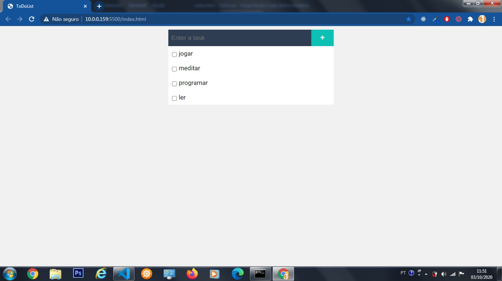
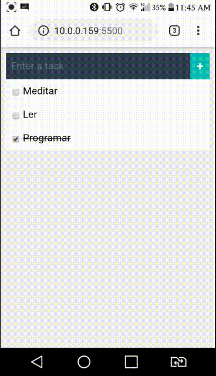

<h1 align = "center">
   
    
   
   
  To Do List
</h1>

 Um ToDoList para organizar o seu dia e aumentar exponencialmente a sua produtividade.

  

[//]: # (Adicione seus gifs / imagens aqui :)

  
  

## Recursos
[//]: # (Adicione os recursos do seu projeto aqui :)
Este projeto apresenta as principais linguagens da Web!

- ⚛️ ** Javascript ** - Uma biblioteca JavaScript para construir interfaces de usuário
- ⚛️ ** HTML5 ** - Uma biblioteca que fornece uma maneira de criar aplicativos nativos para Android e iOS
- 💹 ** CSS3 ** - Uma estrutura da web para Node Js

## Começando

Descreva aqui a forma de usar

1- Clone este repositório em sua máquina com o seguinte comando git clone https://github.com/JeanVictor44/ToDoList 
2- Agora é só abrir o index.html em seu browser favorito 
## Licença

Este projeto está licenciado sob a Licença MIT - consulte a página [LICENSE] (https://opensource.org/licenses/MIT) para obter detalhes.